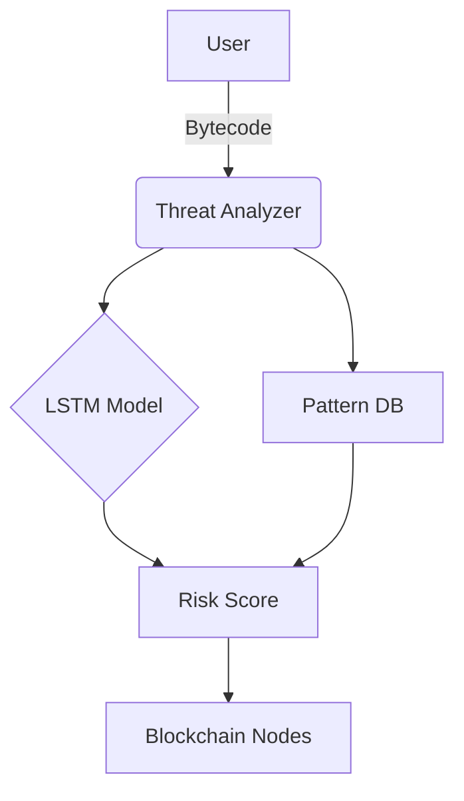

# LidocaineAI Architecture

## Core Components


## Data Flow
1. **Input**:
   - Raw contract bytecode
   - On-chain transaction history

2. **Processing**:
   ```python
   def analyze(bytecode):
       patterns = yara.match(bytecode)
       ml_score = model.predict(bytecode)
       return combine_scores(patterns, ml_score)
   ```

3. **Output**:
   - Risk score (0-100)
   - Threat classification

## Dependencies
- Solana/ETH RPC nodes
- TensorFlow Serving
- Redis (alert caching)
